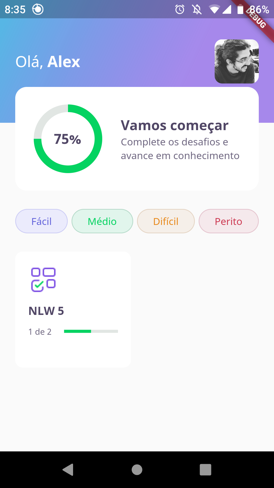
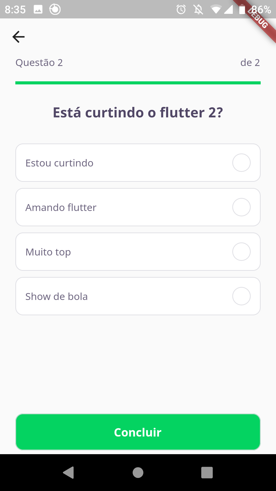

# DevQuiz

DevQuiz is a mobile app in which you can answer questions about different subjects to test your knowledge in each one. The app was developed using Flutter during the **Next Level Week #5**, an event created by the [Rocketseat](https://rocketseat.com.br/) with the purpose to teach several programming skills (in this case, Flutter) to accelerate your career.

<p align="center">
  
  
  
</p>

The objective of this project was to study the main functionalities existing in Flutter apps, such as the creation of screen components and their stylization, as well as the navigation between pages, state management control and logic of the application.

Therefore, the app has **some limitations**, the main ones been:

- There are no backend or database communication, therefore all the data in the app is stored locally in JSON files;
- There are no interfaces to create new questions or edit the existing ones, meaning that any changes must be done directly in the JSON files.

## Getting Started

The project uses only Flutter, with no backend or database access. So, the only requirements to build it is that you have [Flutter installed](https://flutter.dev/docs/get-started/install).

```bash
git clone https://github.com/alexserodio/dev-quiz

cd dev-quiz

flutter pub get

flutter run
```

**IMPORTANT:** the app was tested only on the **Moto X4** device and therefore may not work properly on screens with different size.

### Some possibilities for improvement:

- filter quizzes in home page by difficulty level (the difficulty buttons has no utility at the moment);
- connect with some database such as Firebase to store quizzes, questions and user info there instead of locally;
- make the app responsive for different screen sizes.
